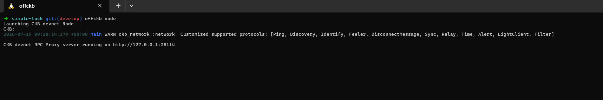
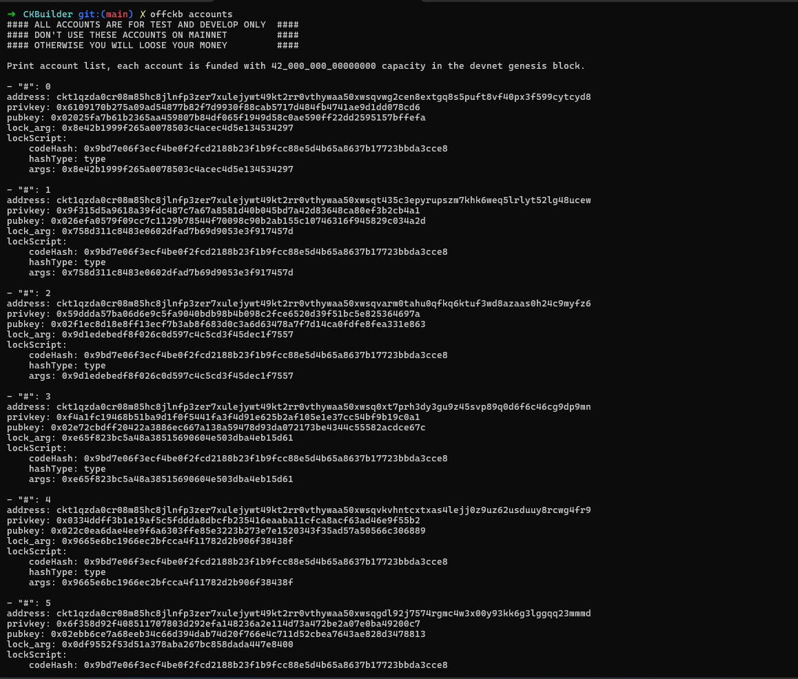
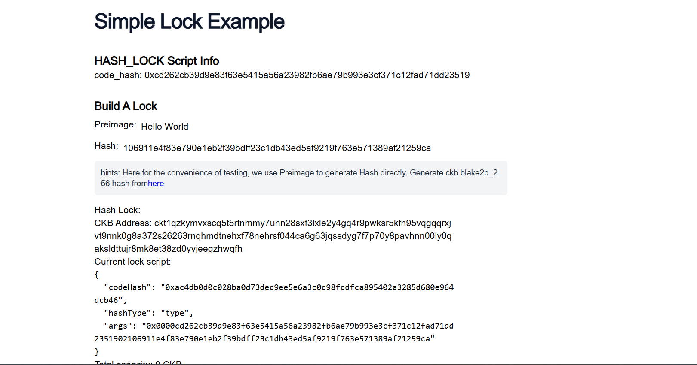

# Builder Track Weekly Report — Week 10

**Name:** Emmanuel Badejo
**Week Ending:** 16-07-2026

# Build DApp

## Build a Simple Lock

## Overview

This tutorial focused on building a complete decentralized application (dApp) that uses a custom Lock Script to secure CKB tokens. The project covered both the blockchain contract and the frontend application, demonstrating how users can lock funds using a cryptographic hash and later unlock them by providing the correct preimage.

The tutorial also introduced transaction construction using the CCC JavaScript SDK, deployment on a local Devnet with OffCKB, and the overall workflow of developing and testing custom CKB Scripts.

---

## Building and Deploying the Hash Lock

Set up the development environment by cloning the Simple Lock project from the Nervos documentation repository and starting a local Devnet using OffCKB.

Installed the required project dependencies, compiled the custom Lock Script, and deployed the contract to the local blockchain.

Configured the frontend application with the generated deployment artifacts and launched the web application locally to interact with the deployed Script.

Verified that the dApp successfully connected to the local Devnet environment.

---

## Creating a Custom Lock Script

Learned how a Lock Script controls whether a Cell can be spent on the CKB blockchain.

Implemented a simple **hash_lock** mechanism where a cryptographic hash is stored inside the Script arguments (`script_args`).

Understood that unlocking the Cell requires providing the original preimage whose Blake2b-256 hash matches the value stored in the Script.

Recognized that this mechanism demonstrates the fundamentals of Script validation while remaining intentionally simple for educational purposes.

---

## Understanding the Script Logic

Examined how the contract retrieves the expected hash from the Script arguments.

Loaded the transaction witness to obtain the user-provided preimage during transaction verification.

Calculated the Blake2b-256 hash of the supplied preimage and compared it against the stored hash.

Observed that the Script returns a success code when both hashes match and rejects the transaction whenever validation fails.

Learned how `@ckb-js-std/core` provides high-level blockchain APIs for accessing Script data and transaction witnesses within JavaScript contracts.

---

## Generating Lock Script Addresses

Studied how the frontend generates a custom Lock Script using the deployed contract information together with the supplied hash value.

Learned that CCC converts the generated Lock Script into a standard CKB address.

Understood that a CKB address is simply an encoded representation of its underlying Lock Script.

Recognized that depositing CKB into an address effectively creates Live Cells secured by that Lock Script.

---

## Depositing and Managing Locked CKB

Used OffCKB to deposit test CKB into the generated hash_lock address.

Learned that balances are calculated by collecting all Live Cells protected by the same Lock Script and summing their capacities.

Understood how the frontend retrieves these balances using the CCC client before constructing new transactions.

---

## Unlocking Locked Funds

Built transactions that consume Live Cells protected by the hash_lock Script and generate new Cells owned by the receiver.

Collected the required inputs automatically using CCC's transaction builder.

Stored the unlocking preimage inside the transaction witness before broadcasting the transaction.

Added the deployed Lock Script as a required Cell Dependency during transaction construction.

Observed that transactions are only accepted by the blockchain when the provided preimage satisfies the validation logic implemented by the Lock Script.

---

## Security Considerations

Studied why the toy hash_lock should not be used to protect real assets.

Learned that the unlocking preimage becomes publicly visible once included in a transaction witness.

Recognized that attackers or miners could observe the revealed preimage and construct competing transactions to steal any remaining locked funds.

Understood that the project is intended purely as an educational introduction to custom Lock Script development.

---

## Network Deployment

Learned that the same application can be deployed on different CKB networks by updating the `NETWORK` environment variable.

Verified that switching from Devnet to Testnet requires configuration changes rather than modifications to the application logic.

---

## Key Learnings

* Built a complete full-stack CKB dApp consisting of both a frontend application and a custom Lock Script.
* Learned how Lock Scripts enforce ownership and spending conditions for CKB Cells.
* Understood how cryptographic hashes and preimages can be used to authorize blockchain transactions.
* Explored how transaction witnesses provide unlocking data during Script execution.
* Used the CCC SDK to generate addresses, build transactions, collect inputs, and broadcast transactions.
* Learned how balances are calculated from Live Cells secured by a specific Lock Script.
* Understood the complete lifecycle of locking, depositing, validating, and unlocking CKB tokens.
* Identified the security weaknesses of simple hash-based locking mechanisms and why production applications require more secure designs.

---

