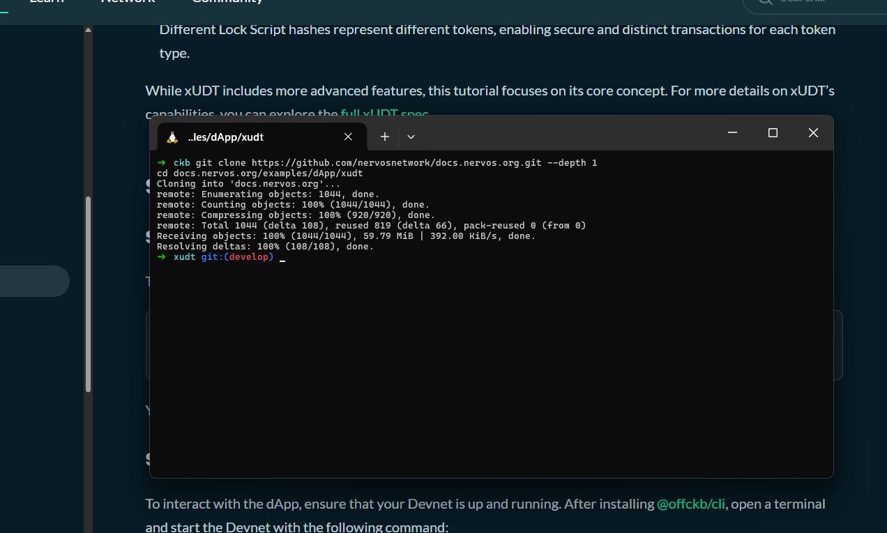
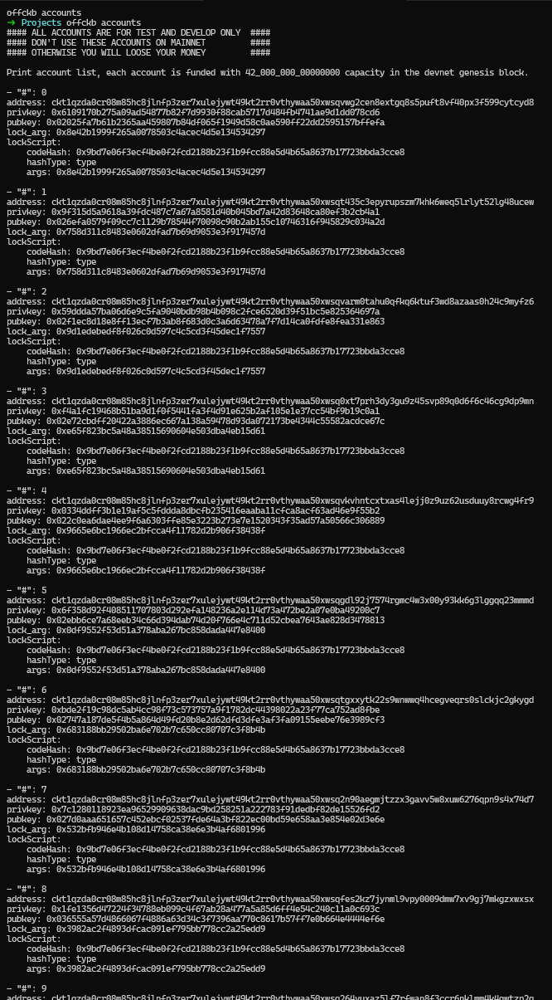
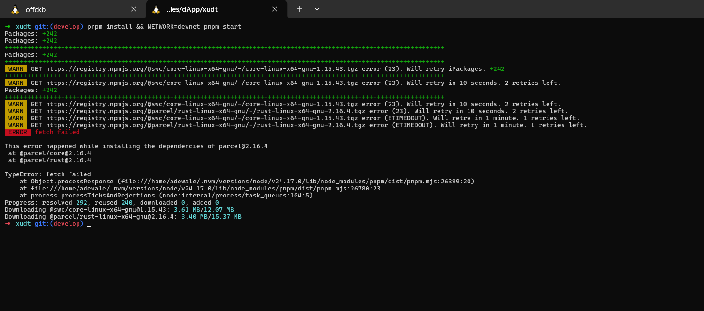
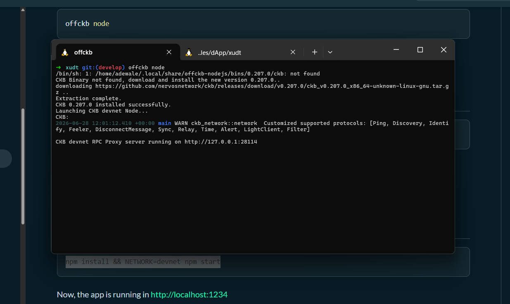

# Builder Track Weekly Report — Week 8

**Name:** Emmanuel Badejo
**Week Ending:** 25-06-2026

# Build DApp

## Create a Fungible Token

# Create a Fungible Token Report

## Overview

Learned how fungible tokens are created on the CKB blockchain using the extensible User-Defined Token (xUDT) standard.

Built and ran the xUDT tutorial dApp on a local Devnet environment using OffCKB and the CCC JavaScript SDK.

Studied how xUDT leverages CKB's Cell Model to issue, identify, query, and transfer custom tokens by utilizing Type Scripts, Lock Scripts, and Cell data.

---

## Understanding xUDT on CKB

Learned that fungible tokens on CKB are implemented as User-Defined Tokens (UDTs) rather than account-based smart contracts.

Studied how the xUDT standard provides a minimal and extensible framework for creating custom tokens on the blockchain.

Understood that each token is represented by a Cell whose Type Script is the xUDT Script, while the Cell's data field stores the token balance.

Learned that the issuer's Lock Script Hash serves as the unique identifier for every custom token, ensuring that different issuers create distinct token types.

---

## Setting Up the Development Environment

Cloned the xUDT tutorial project from the Nervos documentation repository.

Started a local Devnet instance using OffCKB and reviewed the available pre-funded accounts for testing.

Installed all project dependencies and launched the dApp using the Devnet network configuration.

Verified that the application successfully connected to the local blockchain environment through the browser interface.

---

## Issuing a Custom Token

Examined the `issueToken` function responsible for creating new xUDT tokens.

Learned how a signer is created from a private key using the CCC SDK to authorize blockchain transactions.

Generated the issuer's Lock Script and derived the xUDT Script arguments using the Lock Script Hash.

Constructed an output Cell containing the xUDT Type Script while storing the token amount inside the Cell's data field.

Studied how CCC automatically completes transaction inputs, capacity balancing, Cell dependencies, and transaction fees before broadcasting the transaction.

Signed and submitted the transaction to successfully issue a new fungible token.

---

## Understanding Token Identification

Learned that every xUDT token is uniquely identified by the issuer's Lock Script Hash.

Studied how the xUDT Script arguments act as the token's unique identifier across the blockchain.

Understood that multiple token types can coexist securely because each issuer produces a different Lock Script Hash.

Learned that placeholder values appended to the script arguments can enable additional xUDT capabilities beyond the scope of the tutorial.

---

## Querying Token Information and Holders

Studied how issued token Cells can be retrieved using the `queryIssuedTokenCells` function.

Learned how to reconstruct the xUDT Type Script using the token's unique xUDT arguments.

Used the `findCellsByType` API to collect all Live Cells associated with the specified token.

Understood that ownership of each token Cell is determined by its Lock Script, allowing token holders to be identified by the accounts capable of unlocking those Cells.

---

## Transferring Custom Tokens

Examined the `transferTokenToAddress` function responsible for sending tokens between accounts.

Learned how the receiver's Lock Script replaces the sender's Lock Script in newly created output Cells during a transfer.

Collected the sender's existing token Cells using both the xUDT Type Script and the sender's Lock Script.

Constructed a transaction that transferred the specified token amount to the receiver while preserving the correct token Type Script.

Studied how remaining token balances are automatically returned to the sender as change through an additional output Cell.

Completed transaction capacity balancing, transaction fee calculation, signing, and broadcasting using CCC helper functions.

---

## Understanding the xUDT Transaction Flow

Learned that issuing tokens involves creating an output Cell with an xUDT Type Script and storing the token amount inside the Cell's data field.

Studied how querying token balances depends on searching for Live Cells that share the same Type Script.

Understood that token transfers do not modify balances directly but instead consume existing Cells and create new Cells with updated ownership.

Recognized that the Cell Model enables token ownership to be transferred simply by assigning a different Lock Script to newly generated output Cells.

---

## Key Findings

* xUDT is the standard used to create fungible User-Defined Tokens on the CKB blockchain.
* The issuer's Lock Script Hash uniquely identifies every custom token.
* Token balances are stored inside the data field of xUDT Cells.
* Type Scripts define the token type, while Lock Scripts determine ownership.
* Live Cells can be queried using the xUDT Type Script to retrieve token information and holders.
* Token transfers occur by consuming existing Cells and creating new Cells assigned to the receiver's Lock Script.
* CCC simplifies transaction construction, capacity balancing, fee handling, signing, and broadcasting for xUDT operations.

