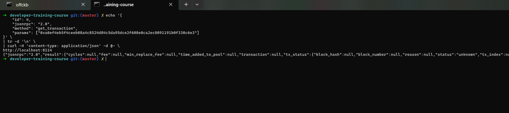
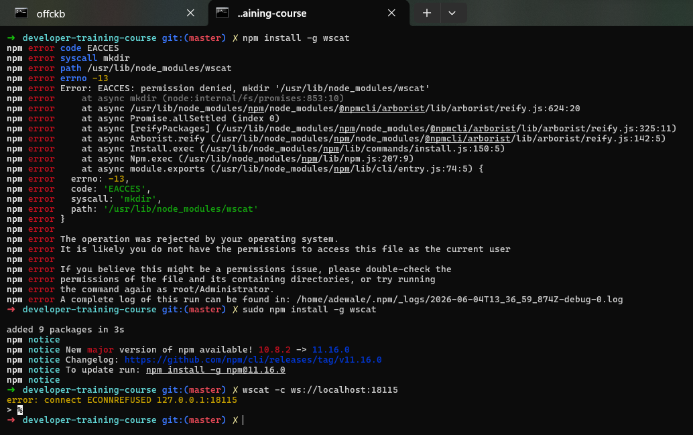

# Builder Track Weekly Report — Week 5

**Name:** Emmanuel Badejo
**Week Ending:** 3-06-2026

# CKB RPCs Report

## Overview

Learned that CKB RPCs (Remote Procedure Calls) are interfaces provided by the Nervos CKB blockchain that allow developers to communicate directly with the network.

Understood that RPCs are used to query blockchain data, submit transactions, manage wallets, and deploy or interact with Scripts.

---

## Public JSON RPC Nodes

Studied the publicly available JSON RPC nodes provided by the community.

Learned that these nodes are useful for development and testing purposes but should not be relied upon for production applications because they may be unstable or unavailable.

### Mainnet RPC Endpoints

* [https://mainnet.ckbapp.dev/](https://mainnet.ckbapp.dev/)
* [https://mainnet.ckb.dev/](https://mainnet.ckb.dev/)

### Testnet RPC Endpoints

* [https://testnet.ckbapp.dev/](https://testnet.ckbapp.dev/)
* [https://testnet.ckb.dev/](https://testnet.ckb.dev/)

---

## Indexer Service

Learned that since CKB v0.105.0, the Indexer Service is included directly within the CKB node.

Understood that developers can use the standard CKB JSON RPC endpoint to access indexing functionality without running a separate indexer service.

---

## RPC Provider: Ankr

Studied Ankr as a third-party RPC provider for the Nervos Network.

Learned that Ankr acts as an intermediary service that allows developers to connect to the blockchain without operating their own node.

### Endpoint Root

* [https://rpc.ankr.com/nervos](https://rpc.ankr.com/nervos)

Understood that network latency may vary depending on the provider's infrastructure and geographic location.

---

# CKB JSON-RPC Protocols Report

## Overview

Learned that CKB exposes its RPC interface using the JSON-RPC 2.0 protocol, allowing applications to communicate with the blockchain through standardized requests and responses.

Understood that JSON-RPC is used for querying blockchain data, sending transactions, monitoring transaction status, and subscribing to blockchain events.

---

## Security Considerations

Learned that CKB RPC endpoints are intended for internal use only.

Understood that exposing RPC endpoints directly to the public internet is strongly discouraged because it can create security risks.

Studied the use of the `rpc.listen_address` configuration option to restrict access to trusted machines only.

Also learned that CKB JSON-RPC currently supports HTTP connections only. For HTTPS support, developers should use a reverse proxy such as Nginx.

---

## Basic RPC Usage

### Fetching the Latest Block Number

Studied the `get_tip_block_number` RPC method.

Learned that it returns the block number of the latest block in the longest chain, making it useful for checking network synchronization and chain status.

---

### Sending Transactions

Studied the `send_transaction` RPC method.

Learned that it is used to broadcast transactions to the CKB network.

Understood that a transaction request contains components such as:

* Inputs
* Outputs
* Cell Dependencies
* Header Dependencies
* Witnesses

---

### Tracking Transaction Status

Studied the `get_transaction` RPC method.

Learned that `send_transaction` is asynchronous, meaning a returned transaction hash does not guarantee that the transaction has been fully verified or accepted.

Understood that developers should use `get_transaction` to monitor the status and confirmation progress of submitted transactions.

---

## Subscription Support

Learned that subscriptions require a full-duplex connection and are not supported over standard HTTP.

Studied the available subscription connection types:

* TCP
* WebSocket

Understood that these connections allow applications to receive blockchain updates in real time.

---

## RPC Configuration

Reviewed the RPC configuration options available in the `CKB.toml` file.

Learned that different ports can be configured for different communication methods:

* `listen_address` – Standard HTTP RPC requests
* `tcp_listen_address` – TCP duplex connections
* `ws_listen_address` – WebSocket duplex connections

Example configuration:

* HTTP RPC → Port 8114
* TCP RPC → Port 18114
* WebSocket RPC → Port 18115

---

## Conclusion

Gained an understanding of how CKB uses the JSON-RPC 2.0 protocol to expose blockchain functionality. Also learned the importance of securing RPC endpoints, handling asynchronous transaction processing, and using TCP or WebSocket connections when subscription features are required.

