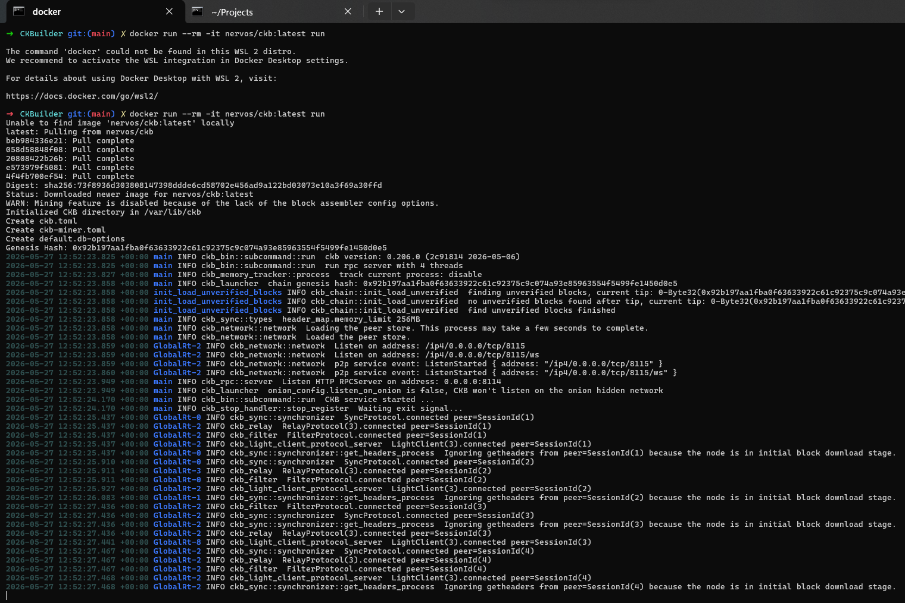
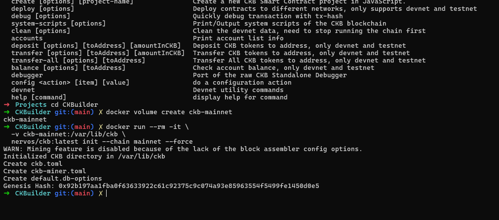

# Builder Track Weekly Report — Week 4

**Name:** Emmanuel Badejo
**Week Ending:** 26-05-2026

# CKB Networks Report

## Overview

Learned that Nervos CKB provides multiple blockchain network environments for development, testing, and production deployment.

Studied the distinction between:

* Public Networks
* Private Networks (Devnet)

Understood that developers typically move progressively from Devnet → Testnet → Mainnet during dApp development.

---

## CKB Mainnet

Learned that Mainnet is the live production blockchain where real-value transactions occur.

Studied the Mainnet RPC endpoints:

* [https://mainnet.ckbapp.dev/](https://mainnet.ckbapp.dev/)
* [https://mainnet.ckb.dev/](https://mainnet.ckb.dev/)

Learned that Mainnet addresses use the `ckb` prefix.

Reviewed the Mainnet Explorer:

* [https://explorer.nervos.org/](https://explorer.nervos.org/)

---

## CKB Testnet (PUDGE)

Learned that Testnet is a public staging environment used for testing Scripts and dApps before Mainnet deployment.

Understood that Testnet simulates production conditions using non-real-value tokens.

Studied the Testnet RPC endpoints:

* [https://testnet.ckbapp.dev/](https://testnet.ckbapp.dev/)
* [https://testnet.ckb.dev/](https://testnet.ckb.dev/)

Reviewed the Testnet Explorer:

* [https://pudge.explorer.nervos.org/](https://pudge.explorer.nervos.org/)

Learned that Testnet addresses use the `ckt` prefix.

Studied the use of the Nervos Faucet for obtaining free test tokens:

* [https://faucet.nervos.org/](https://faucet.nervos.org/)

---

## CKB Devnet

Learned that Devnet is a private local blockchain environment used for rapid development and debugging.

Studied two ways to create a Devnet:

* Using OffCKB
* Running a Devnet node directly

Learned that Devnet addresses also use the `ckt` prefix.

---

## Recommended Development Flow

Studied the recommended deployment workflow:

1. Develop on Devnet
2. Test on Testnet
3. Deploy to Mainnet

Understood that each stage provides increasing levels of production realism.

---

## Network Switching

Learned that switching networks requires changing:

* RPC URLs
* System Script configurations

Studied the OffCKB command for retrieving network system scripts:

```bash
offckb system-scripts --network <devnet/testnet/mainnet>
```


