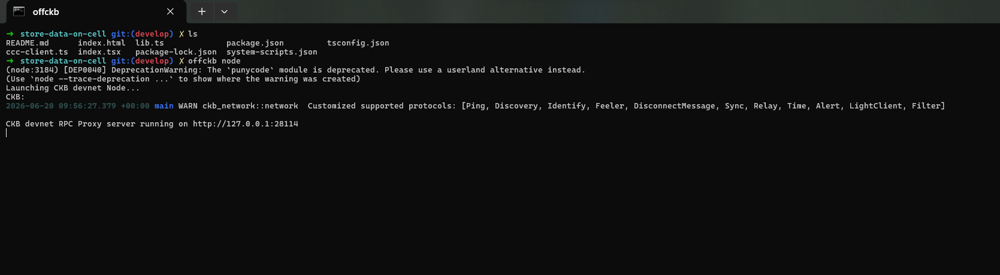
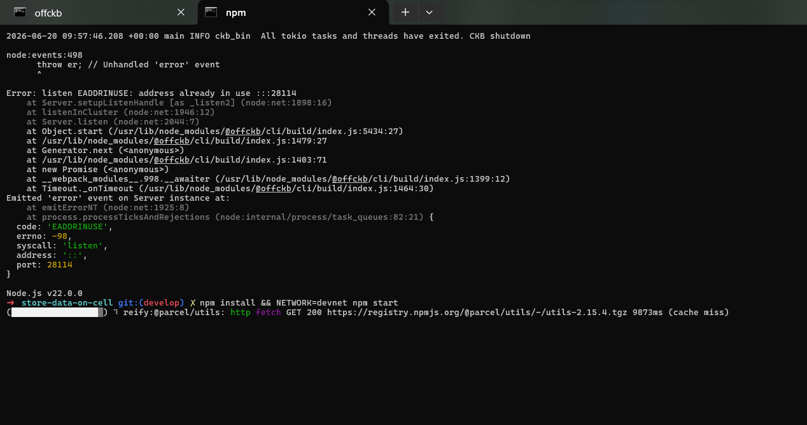
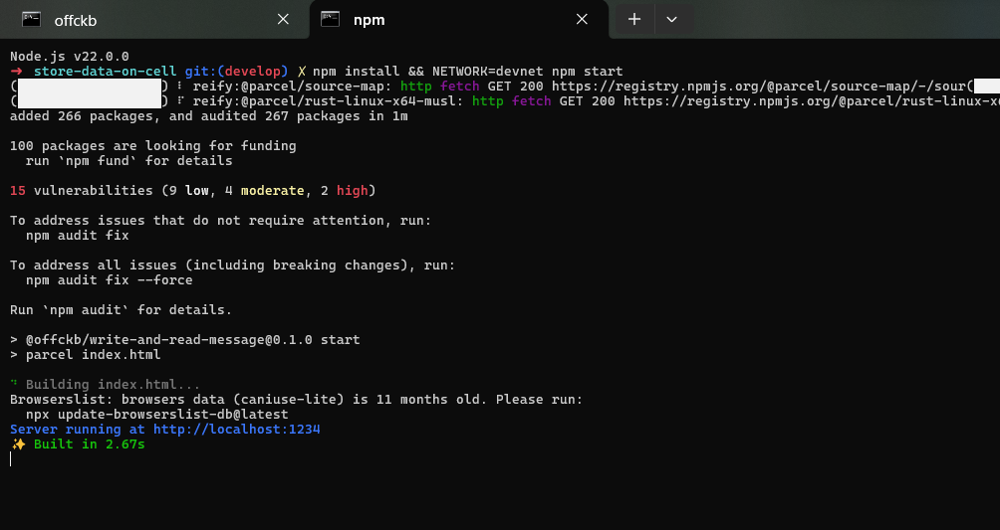
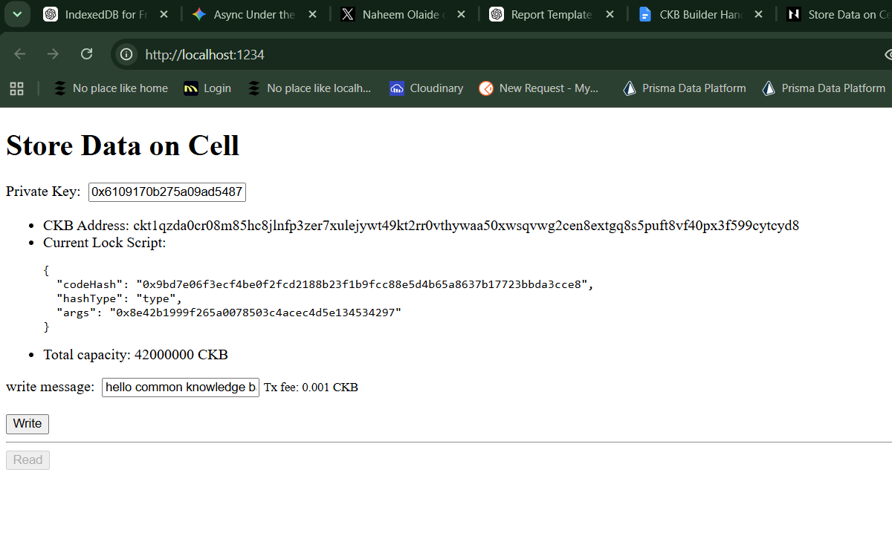

# Builder Track Weekly Report — Week 7

**Name:** Emmanuel Badejo
**Week Ending:** 18-06-2026

# Build DApp

## Store Data on Cell

# Store Data on Cell Report

## Overview

Learned how arbitrary data can be stored directly on the CKB blockchain using the Cell Model.

Built and ran the Store Data on Cell dApp on a local Devnet environment using OffCKB and CCC.

Studied how text messages can be encoded into hexadecimal format, written into a Cell's data field, and later retrieved and decoded back into readable text.

---

## Understanding Cell Data Storage

Learned that every Cell on CKB contains a data field capable of storing arbitrary information in addition to holding capacity.

Studied how application-specific data can be permanently recorded on-chain by placing encoded values inside the Cell's data field.

Understood that storing data on CKB follows the same Cell creation process used when transferring assets, but includes custom data attached to the output Cell.

---

## Setting Up the Development Environment

Cloned the Store Data on Cell tutorial project from the Nervos documentation repository.

Started a local Devnet instance using OffCKB and reviewed the available pre-funded accounts for testing.

Installed project dependencies and launched the dApp locally using the Devnet network configuration.

Verified successful connection to the local blockchain environment through the browser interface.

---

## Encoding and Decoding Messages

Studied how text messages must be converted into a blockchain-friendly format before being stored on-chain.

Learned how the TextEncoder API converts UTF-8 strings into byte arrays which are then transformed into hexadecimal strings.

Implemented a decoding process using TextDecoder to convert hexadecimal data retrieved from a Cell back into human-readable text.

Understood that encoding and decoding strategies are application-specific and can vary depending on data requirements.

---

## Building a Transaction with Data

Examined the buildMessageTx function responsible for creating transactions that store messages on-chain.

Learned how CCC is used to construct a transaction containing an output Cell with custom data.

Converted the text message into hexadecimal format and inserted it into the outputsData field of the transaction.

Studied how CCC automatically completes missing transaction inputs and transaction fees through capacity balancing functions.

Used the signer object to authorize, sign, and broadcast the transaction to the blockchain network.

---

## Reading Data from a Live Cell

Learned how stored data can be retrieved by locating the Live Cell that contains the message.

Studied the use of the getLiveCell RPC method to fetch Cell information using an OutPoint.

Understood that an OutPoint consists of a transaction hash and output index which uniquely identify a Cell on the blockchain.

Retrieved the outputData field from the Cell and decoded it back into the original text message.

Verified that data written to the blockchain could be successfully read and reconstructed.

---

## Understanding Cell Retrieval

Learned that a transaction may generate multiple output Cells, each identified by its output index.

Studied how knowing the transaction hash and output index allows direct access to a specific Cell without performing broader Cell searches.

Understood that the tutorial stores the message in the first output Cell, making the output index consistently set to 0x0.

---

## Key Findings

* The data field of a Cell can store arbitrary application data on-chain.
* Text messages must be encoded into a suitable format before being stored in a Cell.
* CCC simplifies transaction construction, fee handling, and transaction broadcasting.
* Live Cells can be retrieved directly using an OutPoint consisting of a transaction hash and output index.
* Stored blockchain data can be decoded back into its original format for application use.
* CKB Cells function as both value containers and data storage units.

