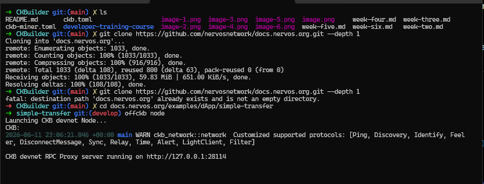
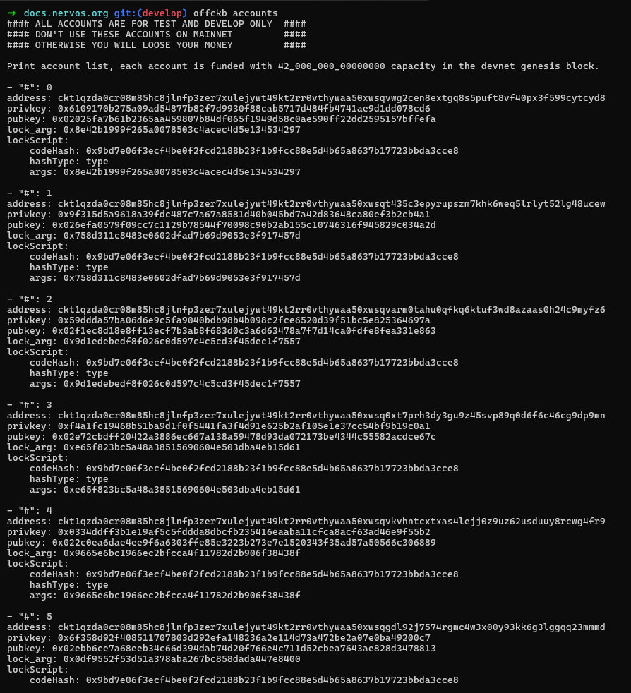

# Builder Track Weekly Report — Week 6

**Name:** Emmanuel Badejo
**Week Ending:** 11-06-2026

# Build DApp
## Transfer CKB 

# View and Transfer a CKB Balance Report

## Overview

Learned how CKB balance transfers work using the Cell Model.

Set up a local Devnet environment with OffCKB and ran the Simple Transfer dApp locally.

Studied how CKB transactions consume existing Cells and create new Cells owned by another account.

---

## CKB Cell Model

Learned that CKB uses a UTXO-like Cell Model rather than a traditional account-based model.

Understood that each Cell contains a capacity value which represents both the CKB balance held by the Cell and the storage space available within it.

Studied that balance transfers are performed by consuming input Cells and generating new output Cells for the recipient.

---

## Setting Up the Tutorial Project

Cloned the Simple Transfer example from the Nervos documentation repository and navigated to the project directory.

Reviewed the project structure used to demonstrate CKB balance transfers on a local development network.

---

## Running a Local Devnet

Started a local CKB Devnet using OffCKB.

Reviewed the pre-funded development accounts generated by OffCKB and obtained account credentials for testing transactions.

Learned that Devnet provides a safe environment for testing without using real-value assets.

---

## Running the Simple Transfer dApp

Installed the project dependencies and launched the application using the Devnet network configuration.

Accessed the application locally through the browser and verified that it connected successfully to the running Devnet instance.

---

## Key Findings

* CKB transfers are performed through Cell consumption and Cell creation.
* Cell capacity represents both token balance and storage allocation.
* OffCKB simplifies local development by providing a ready-to-use Devnet environment.
* Pre-funded accounts make it easy to test transactions during development.
* The Simple Transfer example demonstrates the basic transaction flow used when moving CKB between accounts.

---

