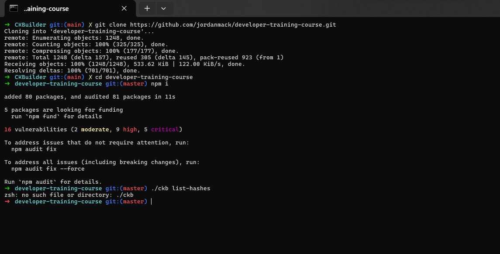
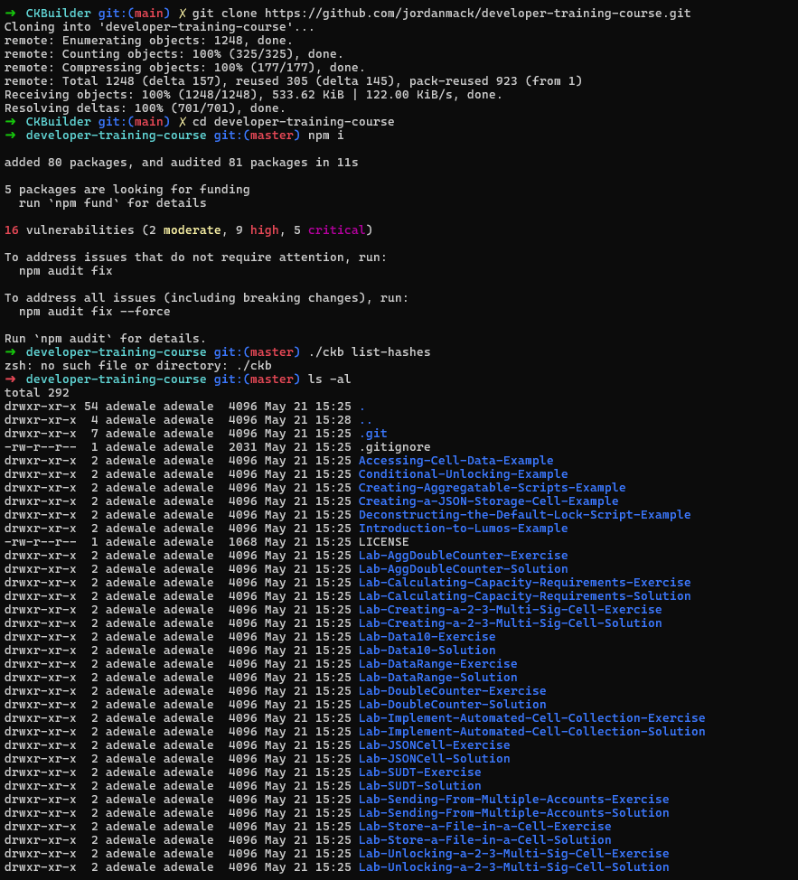
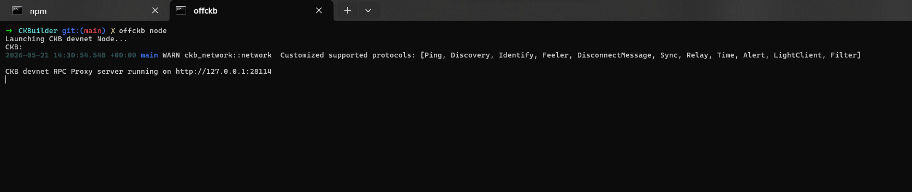

# Builder Track Weekly Report — Week 3

**Name:** Emmanuel Badejo
**Week Ending:** 19-05-2026

## Courses & Reading Completed
## Nervos CKB Development Course Introduction

* Began studying the Nervos CKB Layer 1 developer training course focused on building common blockchain application components on the Nervos ecosystem.
* Learned that the course is designed for developers who already possess foundational blockchain knowledge and want practical experience building on Nervos CKB L1.
* Understood that the training emphasizes hands-on learning through:

  * Guided examples
  * Practical lab exercises
  * Sequential project-based lessons
* Learned that Nervos CKB Layer 1 is built around the **Cell Model**, which is inspired by Bitcoin’s **UTXO (Unspent Transaction Output) Model**.
* Explored how the Cell Model differs significantly from Ethereum’s account-based EVM architecture.
* Understood that Nervos CKB L1 is not EVM-compatible and requires developers to adopt a different approach to smart contract and application design.
* Learned that the Cell Model is considered more flexible and storage-efficient than traditional account-based blockchain models, though it introduces greater architectural complexity for developers.
* Studied the distinction between:

  * **CKB Layer 1**, which uses the Cell Model and CKB-VM.
  * **Godwoken Layer 2**, which provides full EVM compatibility for Ethereum-style applications.
* Learned that developers seeking Ethereum-compatible development workflows can instead build on Godwoken L2.
* Reviewed the prerequisite technologies and knowledge areas required for effective Nervos CKB development, including:

  * Blockchain fundamentals
  * JavaScript and TypeScript
  * Rust programming
  * Linux command-line usage
* Understood that familiarity with blockchain concepts such as:

  * Bitcoin
  * Ethereum
  * Smart contracts
  * Tokens
  * Decentralized applications
    is necessary before progressing deeply into Nervos-specific development concepts.
* Learned that JavaScript is heavily used throughout the development labs and examples, while TypeScript is recommended for production-level development.
* Studied the importance of Rust within the Nervos ecosystem since on-chain smart contracts are written using Rust.
* Understood that Rust proficiency is essential for building custom smart contracts and advanced on-chain logic on CKB.
* Learned that many development workflows and examples are performed through a Linux console environment.
* Reviewed how Linux familiarity improves efficiency when working with:

  * Development tooling
  * Package management
  * Blockchain node interaction
  * Smart contract compilation
* Learned that most Linux-based development commands can also operate within:

  * macOS terminals
  * Windows WSL2 environments
* Understood that the course lessons are intentionally structured in sequential order, where each exercise builds on concepts introduced in previous sections.
* Learned the importance of completing exercises progressively without skipping foundational sections to avoid knowledge gaps in later advanced topics.
* Became familiar with the Nervos developer community support structure, including the availability of Discord channels dedicated to the developer training course.
* Understood that community participation and developer feedback are encouraged to improve learning outcomes and course quality.

## Nervos Basics Overview

* Began reviewing foundational materials to understand the Nervos ecosystem and its core design principles.
* Learned that Nervos is built around a layered architecture designed to improve scalability, security, and long-term data storage.

## Core Concepts Studied

* Explored the **Nervos Blockchain** as a modular Layer 1 system designed to serve as a universal store of value and state.
* Studied the **Cell Model**, which replaces traditional account-based systems with a UTXO-inspired structure for greater flexibility and composability.
* Learned about **Consensus mechanisms** in Nervos and how they help maintain network security and decentralization.
* Reviewed the **economic model**, which separates state storage from computation to encourage efficient on-chain resource usage.
* Explored **CKB-VM**, the virtual machine used for executing smart contracts on Nervos Layer 1.

## Learning Resources

* Watched and referenced the **Nervos Nation YouTube Channel** for community-driven explanations of the ecosystem and its design philosophy.
* Understood that community content helps simplify complex architectural concepts and provides real-world context for developers.

## Optional Deep-Dive Materials

* Noted additional in-depth references for advanced study, including:

  * Nervos RFCs – Positioning Paper
  * Nervos RFCs – Crypto-Economic Paper
  * Nervos CKB Whitepaper
* Understood that these materials provide deeper theoretical and economic explanations but are optional at this stage of learning.

## Key Takeaway

* Built a high-level understanding of Nervos as a layered blockchain system where the **Cell Model, CKB-VM, and economic design** work together to support scalable and sustainable decentralized applications.

## Lab Exercise Setup (Nervos CKB Development)

* Began setting up the required development environment for running Nervos CKB L1 lab exercises locally.
* Learned that all course examples are designed for a **Linux-based environment**, which is the recommended setup for development on Nervos.
* Understood that MacOS and Windows (via WSL) are also supported, but may require additional configuration steps.

## Node.js Setup

* Installed **Node.js v18 LTS**, which is the officially supported version for all lab exercises.
* Learned that version consistency is critical since the tooling and examples are tested specifically on Node.js v18.
* Explored two installation options:

  * Direct installation via official Node.js downloads.
  * Using **NVM (Node Version Manager)** for flexible version switching and better development control.

## Rust and Git Installation

* Installed **Rust** using recommended tooling (rustup) for writing and compiling on-chain smart contracts.
* Learned that Rust is essential for interacting with CKB’s smart contract environment.
* Installed **Git** to clone the training repository and manage course code locally.

## Course Repository Setup

* Cloned the **Developer Training Course repository** from GitHub.
* Entered the project directory and installed dependencies using:

  * `npm i`
* Learned that dependency warnings during installation are normal, but version mismatches (especially Node.js) can cause issues.
* Verified Node.js version using `node -v` when troubleshooting setup errors.

## CKB Dev Blockchain Setup

* Set up a **local CKB Dev Blockchain (devnet)** for running and testing transactions locally.
* Learned that the devnet functions as a private test environment simulating a full Nervos CKB node.
* Explored setup options:

  * Manual setup via official devchain instructions.
  * One-click setup using **Tippy**, a GUI-based devnet tool.
* Understood that the devnet is required for executing all lab-based transaction examples.

## Configuring Chain Hashes

* Learned that after initializing a devnet, system cell hashes must be extracted and configured in the project.
* Ran `ckb list-hashes` to retrieve required blockchain configuration data.
* Understood that the **system cell hashes** define key on-chain resources required for transaction construction.
* Updated `config.json` inside the training repository with values from the devnet output.
* Mapped key components such as:

  * `SECP256K1_BLAKE160`
  * `SECP256K1_BLAKE160_MULTISIG`
  * `DAO`
* Learned that each configuration requires:

  * `TX_HASH`
  * `INDEX`
* Understood that a total of **six values** must be updated manually.
* Learned that this setup process only needs to be done once per devnet, but must be repeated if a new chain is created.

## Key Takeaway

* Successfully understood and prepared the full local development stack for Nervos CKB, including **Node.js, Rust, Git, and a local CKB devnet**, along with the required chain configuration for running lab exercises.

